# PharmaBiz — Architecture technique cible

Date : 2026-07-14

## 1. Vision produit

PharmaBiz est une plateforme d'exécution commerciale spécialisée pharmacie.

Le produit ne doit pas être pensé comme un CRM générique. Il doit être pensé comme une couche opérationnelle entre :

- les marques santé ;
- les agents commerciaux terrain ;
- les intervenants animation / formation ;
- les pharmacies ;
- les CRM externes des marques.

Le cycle central est :

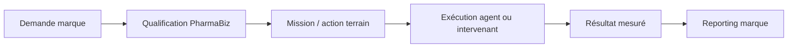

Phrase cible :

> PharmaBiz connecte les marques santé au terrain pharmacie pour planifier, exécuter et mesurer leurs actions commerciales.

## 2. Stack cible

La V1 conserve la stack existante :

- Front-end : Vite + React.
- Back-end applicatif : Supabase.
- Base de données : Postgres Supabase.
- Authentification : Supabase Auth.
- Sécurité données : RLS Supabase.
- Fonctions serveur : Supabase Edge Functions.
- Déploiement : Vercel.
- Connecteurs : HubSpot pour Naali, autres CRM ensuite.
- Canal conversationnel : Twilio WhatsApp + IA.

Décision mobile :

- V1 : web mobile responsive prioritaire.
- V2 : PWA.
- V3 : application mobile native seulement si l'usage terrain le justifie.

## 3. Modes marque

Chaque marque peut fonctionner selon trois modes.

### 3.1 Mode CRM connecté

La marque garde son CRM comme source commerciale principale.

Exemple : Naali avec HubSpot.

PharmaBiz importe :

- pharmacies clientes ;
- contacts ;
- produits ;
- historique de commandes ;
- CA ;
- remises historiques ;
- owner / agent ;
- deals utiles ;
- statuts client.

PharmaBiz renvoie :

- commandes ;
- deals ;
- lignes produits ;
- comptes rendus ;
- prochaines actions ;
- statuts de mission.

### 3.2 Mode PharmaBiz natif

La marque n'a pas de CRM.

PharmaBiz devient sa source principale pour :

- pharmacies ;
- contacts ;
- produits ;
- prix ;
- commandes ;
- missions ;
- animations ;
- formations ;
- reporting.

### 3.3 Mode hybride

Une partie des données vient d'un CRM, une autre est gérée directement dans PharmaBiz.

## 4. Comptes, rôles et capacités

PharmaBiz utilise un modèle `rôle principal + capacités`.

### 4.1 Rôles principaux

- `agent` : commercial terrain.
- `intervenant` : animateur, formateur, prestataire terrain.
- `brand_manager` : utilisateur marque.
- `admin` : équipe PharmaBiz.

### 4.2 Capacités

Les capacités complètent le rôle principal :

- `can_sell`
- `can_train`
- `can_animate`
- `can_validate_orders`
- `can_manage_brand`
- `can_view_finance`
- `can_manage_integrations`
- `can_admin`

Exemples :

- Amir : rôle `agent`, capacité `can_sell`.
- Formatrice : rôle `intervenant`, capacités `can_train`, `can_animate`.
- Responsable Naali : rôle `brand_manager`, capacités `can_manage_brand`, `can_validate_orders`.
- Admin PharmaBiz : rôle `admin`, capacité `can_admin`.

## 5. Modèle de données cible

### 5.1 Identité et accès

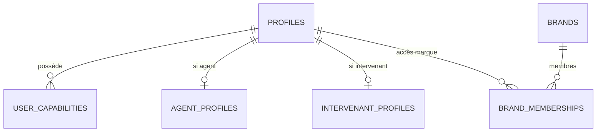

Tables :

- `profiles`
- `user_capabilities`
- `agent_profiles`
- `intervenant_profiles`
- `brands`
- `brand_memberships`

### 5.2 Pharmacies globales

Décision validée : une pharmacie est globale dans PharmaBiz.

Une même officine peut être :

- cliente Naali ;
- prospect d'une autre marque ;
- couverte par Amir ;
- ciblée par une mission d'animation.

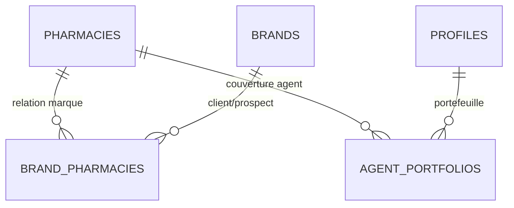

Tables :

- `pharmacies`
- `pharmacy_contacts`
- `brand_pharmacies`
- `agent_portfolios`

`pharmacies` contient l'identité établissement :

- nom ;
- adresse ;
- ville ;
- code postal ;
- coordonnées GPS ;
- téléphone ;
- titulaire si connu ;
- métadonnées établissement.

`brand_pharmacies` contient la relation marque/pharmacie :

- `brand_id`
- `pharmacy_id`
- statut : prospect, client, dormant, perdu ;
- score potentiel ;
- dernier achat ;
- CA marque ;
- owner CRM externe ;
- ID CRM externe ;
- champs spécifiques marque.

`agent_portfolios` contient la relation agent/pharmacie :

- `agent_id`
- `pharmacy_id`
- zone ;
- priorité ;
- statut relation terrain ;
- dernier contact ;
- prochaine action.

### 5.3 Marques et intégrations CRM

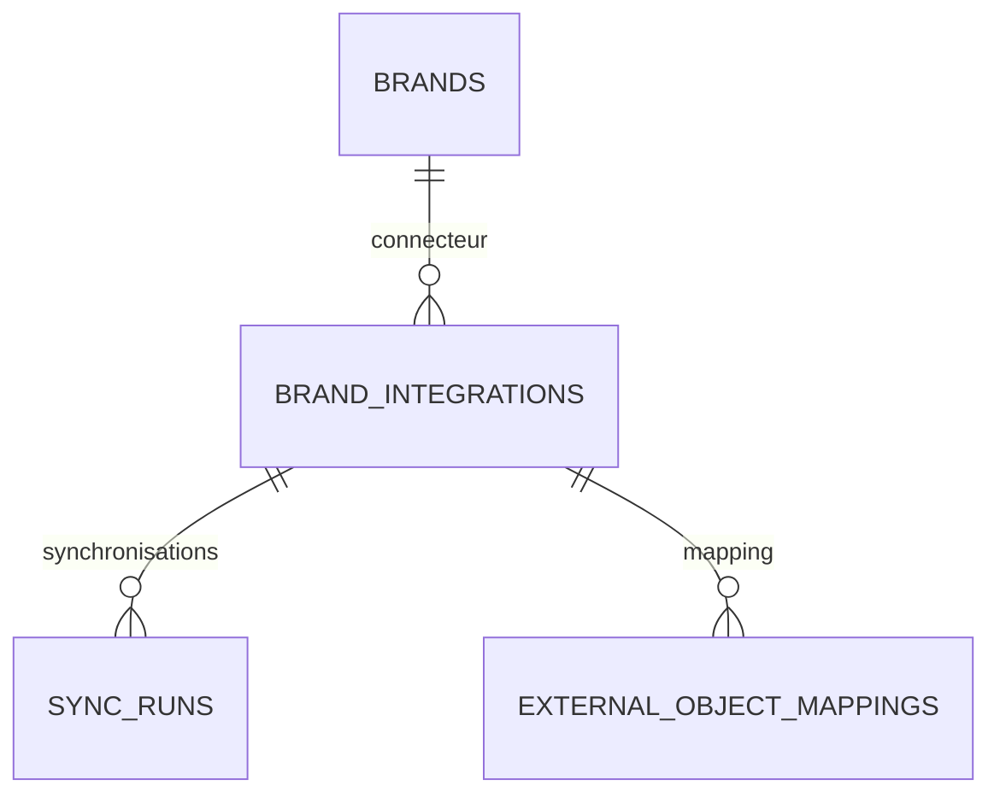

Tables :

- `brand_integrations`
- `external_object_mappings`
- `sync_runs`
- `sync_errors`

`brand_integrations` :

- `brand_id`
- `provider` : hubspot, salesforce, pipedrive, pharmabiz_native, other
- `status`
- `external_account_id`
- `field_mapping`
- `sync_rules`
- `owner_filter`
- `customer_filter`
- `last_sync_at`

Principe :

- aucun secret CRM dans le front-end ;
- tokens stockés côté serveur / Supabase ;
- sync exécutée via Edge Functions ;
- chaque objet synchronisé garde un ID interne PharmaBiz et un ID externe CRM.

### 5.4 Produits, prix et conditions commerciales

Décision validée : catalogue par marque + conditions commerciales par pharmacie / segment.

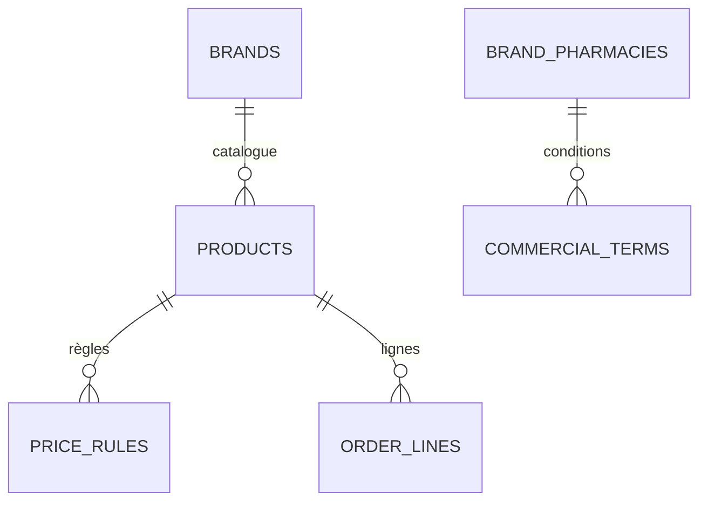

Tables :

- `products`
- `price_rules`
- `commercial_terms`
- `product_segments`

`products` :

- `brand_id`
- nom ;
- SKU ;
- EAN ;
- format ;
- gamme ;
- prix HT officiel ;
- TVA ;
- statut actif/inactif ;
- ID produit CRM externe.

`commercial_terms` :

- `brand_pharmacy_id`
- remise habituelle ;
- franco ;
- minimum commande ;
- conditions négociées ;
- source : CRM, manuel, historique.

`price_rules` :

- règle par marque ;
- règle par produit ou gamme ;
- période promotionnelle ;
- remise max ;
- offre pack ;
- quantité minimale.

Règle forte :

> Le prix HT officiel doit toujours venir du catalogue marque ou du CRM source. Aucun prix ne doit être inventé côté UI.

### 5.5 Missions

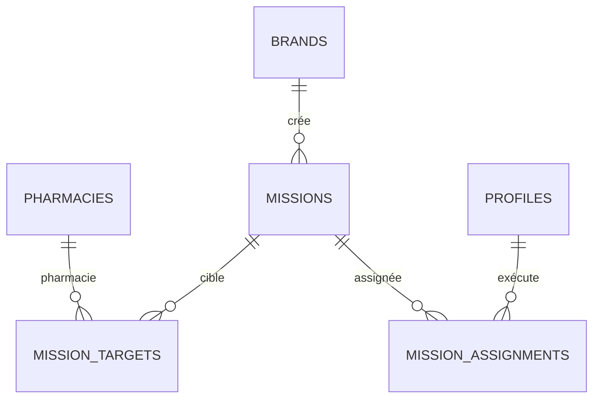

Tables :

- `missions`
- `mission_targets`
- `mission_assignments`
- `mission_results`
- `mission_pricing_rules`

Types de mission :

- prospection ;
- réassort ;
- animation ;
- formation ;
- lancement produit ;
- merchandising ;
- audit ;
- relance ;
- développement commercial.

Statuts :

- brouillon ;
- à qualifier ;
- qualifiée ;
- assignée ;
- en cours ;
- terminée ;
- facturable ;
- clôturée ;
- annulée.

### 5.6 Actions terrain

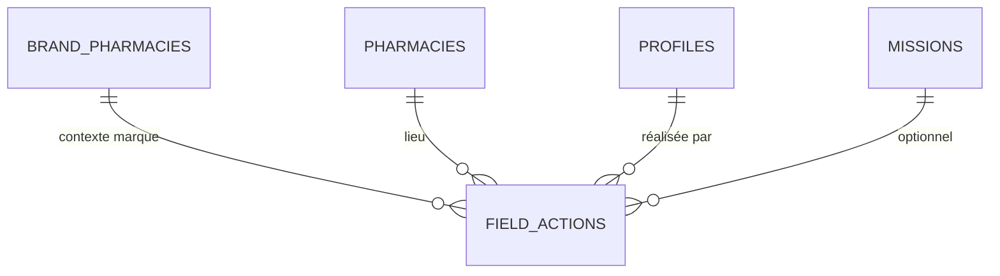

Tables :

- `field_actions`
- `field_action_notes`
- `field_action_attachments`
- `follow_ups`

Types :

- visite ;
- appel ;
- relance ;
- commande ;
- formation ;
- animation ;
- note ;
- rendez-vous ;
- opportunité.

Chaque action doit répondre à une logique terrain :

- quoi faire ;
- pourquoi ;
- pour quelle marque ;
- pour quelle pharmacie ;
- avec quel résultat ;
- quelle suite.

### 5.7 Commandes

Décision validée : commande libre ou rattachée à une mission.

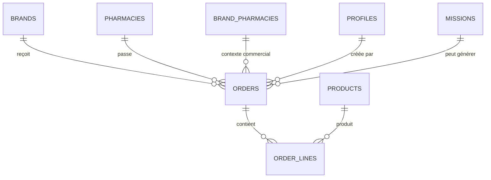

Tables :

- `orders`
- `order_lines`
- `order_approvals`
- `brand_order_rules`

`orders` :

- `brand_id`
- `pharmacy_id`
- `brand_pharmacy_id`
- `agent_id`
- `mission_id` nullable
- `source` : spontaneous, mission, reorder, imported_crm, pharmacy_link, whatsapp
- `created_by_type` : agent, brand, pharmacy_link, ai_assistant, admin
- `attributed_agent_id`
- `status` : draft, submitted, pending_validation, synced, confirmed, cancelled
- `validation_status`
- `validation_required_reason`
- `external_deal_id`
- `total_ht`
- `discount_rate`

`order_lines` :

- produit ;
- quantité ;
- prix catalogue HT ;
- remise appliquée ;
- prix net HT ;
- raison de remise ;
- validation requise ou non.

### 5.8 Validation commande

Décision validée : validation selon règles.

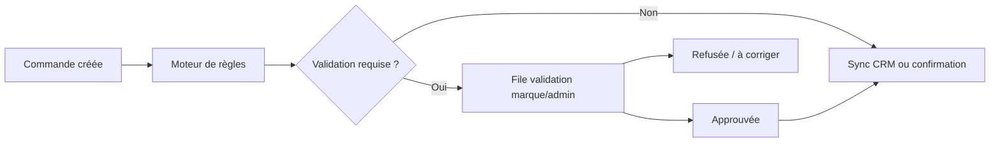

Règles configurables :

- remise maximale ;
- montant max sans validation ;
- nouveau client ;
- produit sensible ;
- mission spéciale ;
- marge minimale ;
- agent autorisé ou non ;
- incohérence prix catalogue.

Règle Naali exemple :

- remise habituelle ou seuil autorisé : auto ;
- remise exceptionnelle : validation ;
- nouveau client : validation ;
- prix incohérent : blocage.

### 5.9 Liens sécurisés pharmacie

Décision validée : pas de portail pharmacie complet en V1.

V1 :

- lien sécurisé de confirmation ;
- repasse commande simple ;
- demande rappel ;
- confirmation RDV / animation.

V2 :

- compte pharmacie complet ;
- catalogue autorisé ;
- commandes autonomes ;
- historique ;
- demandes de visite.

Tables V1 :

- `public_action_links`
- `pharmacy_link_sessions`
- `pharmacy_link_events`

Tables V2 :

- `pharmacy_users`
- `pharmacy_portal_access`

Toute commande créée via lien pharmacie doit être attribuée à l'agent du portefeuille :

- `orders.created_by_type = pharmacy_link`
- `orders.attributed_agent_id = agent_portfolios.agent_id`

## 6. Espace Agent

L'espace agent est prioritaire mobile.

Objectif :

1. décider quoi faire ;
2. préparer une visite ;
3. exécuter une action ;
4. enregistrer le résultat ;
5. planifier la suite.

Modules V1 :

- cockpit du jour ;
- carte portefeuille ;
- fiche pharmacie 360 ;
- actions rapides ;
- commandes ;
- missions ;
- relances ;
- historique ;
- commissions suivies.

Principes UX :

- chaque écran mène à une action ;
- saisie minimale ;
- grosses zones tactiles mobile ;
- priorité aux pharmacies chaudes ;
- badges marque visibles ;
- historique global + historique spécifique marque.

## 7. Espace Marque

L'espace marque ne doit pas être une liste CRM passive.

Il doit montrer :

- ce qui a été demandé ;
- ce qui est qualifié ;
- qui intervient ;
- quelles pharmacies sont touchées ;
- combien ça coûte ;
- ce que ça génère.

Modules V1 :

- tableau de bord marque ;
- réseau pharmacies ;
- produits ;
- missions ;
- commandes ;
- reporting ;
- intégrations CRM ;
- validation commandes.

Workflow marque :

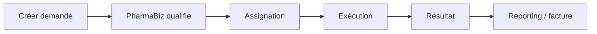

## 8. Espace Intervenant

L'intervenant peut être animateur, formateur ou prestataire terrain.

Il voit :

- missions assignées ;
- brief marque ;
- pharmacie cible ;
- créneau ;
- objectifs ;
- preuves à fournir ;
- rémunération prévue.

Il agit :

- accepter/refuser mission ;
- préparer intervention ;
- déclarer présence ;
- compléter compte rendu ;
- ajouter photos ;
- remonter opportunités.

## 9. Admin PharmaBiz

L'admin pilote :

- utilisateurs ;
- rôles ;
- marques ;
- intégrations ;
- données ;
- qualité sync ;
- missions ;
- facturation marque ;
- paiements intervenants ;
- support.

## 10. Flux financiers

Décision validée :

- la marque paie PharmaBiz ;
- PharmaBiz paie les intervenants pour animations / formations / prestations ;
- PharmaBiz ne paie pas automatiquement les agents commerciaux ;
- les commissions agents peuvent être suivies mais pas forcément payées par PharmaBiz ;
- la pharmacie paie la marque via le circuit habituel ;
- PharmaBiz n'encaisse pas les commandes pharmacie en V1.

Tables :

- `subscription_plans`
- `brand_subscriptions`
- `billable_events`
- `brand_invoices`
- `brand_invoice_lines`
- `intervention_payouts`
- `agent_commission_tracking`

Facturation hybride :

- abonnement ;
- connecteur CRM ;
- setup mission ;
- prix par action ;
- animation / formation ;
- reporting ;
- succès éventuel.

## 11. WhatsApp IA via Twilio

Décision validée : WhatsApp devient un canal d'exécution terrain.

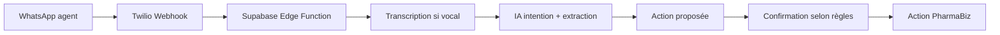

Cas d'usage :

- compte rendu vocal après visite ;
- création de relance ;
- brouillon commande ;
- note pharmacie ;
- demande d'animation ;
- opportunité commerciale ;
- préparation de visite.

Tables :

- `communication_channels`
- `whatsapp_conversations`
- `whatsapp_messages`
- `voice_transcriptions`
- `ai_intent_runs`
- `ai_action_policies`
- `ai_action_drafts`
- `ai_action_confirmations`
- `ai_audit_logs`

Règles IA :

- notes, comptes rendus, tâches et rappels peuvent être automatiques ;
- commandes, remises, deals CRM et sync CRM demandent confirmation agent ;
- remises exceptionnelles, gros montants, nouveaux clients et produits sensibles peuvent demander validation marque/admin ;
- chaque action IA doit conserver une trace auditable.

## 12. Sécurité et RLS

Principes Supabase :

- RLS activée sur toutes les tables exposées ;
- aucun secret dans le front-end ;
- aucun token CRM côté client ;
- règles par rôle et appartenance réelle ;
- ne pas utiliser `user_metadata` pour autoriser ;
- privilégier `profiles`, `brand_memberships`, `user_capabilities` ;
- vues avec `security_invoker` si exposées ;
- fonctions sensibles côté Edge Functions ou fonctions SQL protégées.

Règles d'accès principales :

- agent : voit son portefeuille, ses marques autorisées, ses missions, ses commandes ;
- marque : voit uniquement ses données marque ;
- intervenant : voit uniquement ses missions assignées ;
- admin : voit tout ;
- lien pharmacie : accès limité par token expirant et action précise.

## 13. Architecture front-end cible

Organisation recommandée :

```text
src/
  app/
    auth/
    routing/
    shell/
  features/
    agent/
    brand/
    intervenant/
    admin/
    pharmacy-links/
    integrations/
    whatsapp-ai/
  components/
    ui/
    layout/
    data-display/
  lib/
    supabase/
    formatters/
    permissions/
    crm/
  styles/
    tokens.css
    agent.css
    brand.css
```

Principes :

- éviter les composants monolithiques ;
- séparer UI, logique métier, accès données, types ;
- construire brique par brique ;
- ne plus mélanger ancienne UI et nouvelle brique agent ;
- design system cohérent : crème, bleu marine, orange, bordures foncées, ombres décalées, cockpit terrain.

## 14. Edge Functions cible

Fonctions prévues :

- `hubspot-sync`
- `crm-sync-dispatcher`
- `order-submit`
- `order-sync-crm`
- `mission-qualify`
- `public-link-action`
- `twilio-whatsapp-webhook`
- `ai-action-runner`
- `billing-events-generate`

Chaque fonction doit :

- vérifier l'identité ;
- vérifier les permissions ;
- journaliser les actions ;
- retourner des erreurs lisibles ;
- ne jamais exposer de secret.

## 15. Roadmap technique

### V1 — Socle exécution terrain

1. Reprendre le socle rôles / capacités.
2. Stabiliser le modèle pharmacies globales.
3. Ajouter `brand_pharmacies`.
4. Ajouter `agent_portfolios`.
5. Construire l'espace agent mobile.
6. Nettoyer l'intégration Naali / HubSpot.
7. Importer catalogue Naali proprement.
8. Construire commandes + lignes + règles.
9. Ajouter validation commande selon règles.
10. Construire missions marque simples.
11. Ajouter reporting marque minimal.
12. Ajouter liens sécurisés pharmacie.

### V1.5 — Canal terrain conversationnel

1. Twilio WhatsApp inbound.
2. Identification agent par numéro.
3. Stockage messages.
4. Transcription vocale.
5. Extraction intention.
6. Brouillons actions.
7. Confirmation agent.
8. Création notes, relances, brouillons commandes.

### V2 — Plateforme multi-marques avancée

1. Connecteurs CRM additionnels.
2. Portail pharmacie complet.
3. PWA terrain.
4. Missions avancées.
5. Facturation marque structurée.
6. Paiements intervenants.
7. Reporting ROI marque.
8. IA préparation visite.

### V3 — Extension produit

1. Application mobile native si nécessaire.
2. Marketplace intervenants.
3. Optimisation tournée avancée.
4. Scoring prédictif pharmacies.
5. Portail pharmacie multi-marques.
6. Automatisations CRM avancées.

## 16. Ordre de développement recommandé

Ordre validé :

1. Socle rôles + données propres.
2. Espace agent mobile.
3. Naali / HubSpot propre.
4. Commandes + règles.
5. Missions marque.
6. Liens sécurisés pharmacie.
7. WhatsApp IA bêta.
8. Reporting marque.

## 17. Décisions verrouillées

- PharmaBiz peut être CRM terrain natif ou couche connectée au CRM marque.
- Naali utilise HubSpot comme source CRM.
- Les autres marques peuvent utiliser HubSpot, un autre CRM ou PharmaBiz natif.
- Pharmacie globale dans PharmaBiz.
- Relation commerciale via `brand_pharmacies`.
- Relation terrain via `agent_portfolios`.
- Agents mono ou multi-marques.
- Commandes libres ou rattachées à mission.
- Validation commande selon règles.
- Catalogue par marque + conditions commerciales par pharmacie / segment.
- Facturation hybride.
- Pas de portail pharmacie complet en V1.
- Lien sécurisé pharmacie en V1.
- Web mobile en V1, application plus tard.
- WhatsApp IA via Twilio prévu comme canal officiel.
