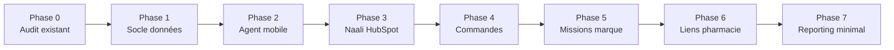

# PharmaBiz — Plan d'exécution V1

Date : 2026-07-14

Référence : `docs/ARCHITECTURE_TECHNIQUE_CIBLE.md`

## Objectif V1

Construire le socle exécution terrain de PharmaBiz sans repartir dans une interface générique.

La V1 doit permettre :

- à un agent de piloter son portefeuille pharmacie sur mobile ;
- à une marque de suivre son réseau, ses commandes et ses premières missions ;
- à Naali d'utiliser HubSpot comme source CRM ;
- à PharmaBiz de gérer proprement pharmacies globales, relations marque/pharmacie, portefeuille agent, commandes et règles de validation ;
- aux pharmacies d'agir via lien sécurisé, sans portail complet.

## Principes d'exécution

- Ne pas mélanger ancienne UI et nouvelle brique agent.
- Commencer par le modèle de données avant d'empiler des écrans.
- Préserver Supabase, Vite, React, Vercel.
- Ne jamais exposer de clé secrète dans le front-end.
- Activer RLS sur toute table exposée.
- Construire petit, vérifiable, puis élargir.
- Priorité mobile pour l'agent.

## Phases V1

## Phase 0 — Audit technique existant

But : savoir exactement ce qu'on garde, ce qu'on migre, ce qu'on isole.

### Ticket 0.1 — Cartographier le schéma Supabase actuel

Livrables :

- liste des tables existantes ;
- relations existantes ;
- tables utiles à conserver ;
- tables temporaires ou obsolètes ;
- politiques RLS actuelles ;
- fonctions Edge existantes.

Critères d'acceptation :

- aucun changement de schéma ;
- document court d'état des lieux ;
- risques identifiés avant migration.

### Ticket 0.2 — Cartographier le front-end actuel

Livrables :

- routes / vues existantes ;
- composants agent actuels ;
- composants marque actuels ;
- composants admin/intervenant existants ;
- styles globaux et conflits probables.

Critères d'acceptation :

- séparation claire entre code réutilisable et code à remplacer ;
- liste des composants à ne plus utiliser dans l'espace agent.

### Ticket 0.3 — Sécuriser l'état de départ

Livrables :

- build fonctionnel ;
- état Git lisible ;
- liste des changements déjà présents ;
- sauvegarde logique avant migration.

Critères d'acceptation :

- `npm run build` passe ou erreurs documentées ;
- aucun reset destructeur ;
- aucun changement non compris supprimé.

## Phase 1 — Socle données multi-marques

But : poser le modèle qui évite les doublons et permet le multi-marques.

### Ticket 1.1 — Stabiliser `profiles`

Livrables :

- confirmer structure `profiles` ;
- ajouter ou normaliser `primary_role` ;
- préparer les rôles : agent, intervenant, brand_manager, admin.

Critères d'acceptation :

- un utilisateur peut avoir un rôle principal clair ;
- les décisions d'autorisation ne reposent pas sur `user_metadata`.

### Ticket 1.2 — Ajouter `user_capabilities`

Livrables :

- table `user_capabilities` ;
- capacités : sell, train, animate, validate_orders, manage_brand, view_finance, manage_integrations, admin ;
- seed minimal pour les comptes existants.

Critères d'acceptation :

- un utilisateur peut avoir plusieurs capacités ;
- RLS empêche un utilisateur de modifier ses propres droits.

### Ticket 1.3 — Stabiliser `brands`

Livrables :

- structure `brands` ;
- champ `operating_mode` : connected_crm, pharmabiz_native, hybrid ;
- champ statut ;
- relation avec utilisateurs marque.

Critères d'acceptation :

- Naali existe comme marque ;
- Naali est en mode `connected_crm`.

### Ticket 1.4 — Ajouter `brand_memberships`

Livrables :

- table d'appartenance utilisateur/marque ;
- rôle dans la marque ;
- capacités marque éventuelles.

Critères d'acceptation :

- un brand manager voit seulement ses marques ;
- un admin voit toutes les marques ;
- un agent ne devient pas brand manager par erreur.

### Ticket 1.5 — Refondre pharmacies globales

Livrables :

- table `pharmacies` comme établissement global ;
- champs adresse, ville, CP, GPS, téléphone, titulaire ;
- stratégie de dédoublonnage.

Critères d'acceptation :

- une pharmacie n'est pas dupliquée par marque ;
- les données établissement ne dépendent pas de Naali.

### Ticket 1.6 — Ajouter `brand_pharmacies`

Livrables :

- relation marque/pharmacie ;
- statut client/prospect/dormant/perdu ;
- ID CRM externe ;
- owner externe ;
- CA marque ;
- dernier achat ;
- champs spécifiques marque.

Critères d'acceptation :

- une même pharmacie peut être cliente Naali et prospect d'une autre marque ;
- les données Naali spécifiques ne polluent pas la fiche globale.

### Ticket 1.7 — Ajouter `agent_portfolios`

Livrables :

- relation agent/pharmacie ;
- priorité ;
- zone ;
- statut terrain ;
- dernière action ;
- prochaine action.

Critères d'acceptation :

- Amir peut couvrir 55 pharmacies ;
- la couverture agent est indépendante du statut client Naali.

### Ticket 1.8 — Ajouter `agent_brand_assignments`

Livrables :

- relation agent/marque ;
- statut actif ;
- périmètre ;
- dates éventuelles.

Critères d'acceptation :

- un agent peut représenter une ou plusieurs marques ;
- une marque peut avoir plusieurs agents.

## Phase 2 — Espace agent mobile

But : reconstruire la brique agent proprement, fidèle à la direction artistique validée.

### Ticket 2.1 — Créer shell agent V1 isolé

Livrables :

- shell agent sans ancienne UI ;
- navigation mobile ;
- navigation desktop ;
- design crème / bleu marine / orange ;
- bordures foncées, ombres décalées, cartes rectangulaires.

Critères d'acceptation :

- aucun composant visuel ancien ne fuite dans l'espace agent ;
- navigation tactile utilisable ;
- rendu lisible mobile et desktop.

### Ticket 2.2 — Cockpit du jour

Livrables :

- priorités du jour ;
- visites recommandées ;
- relances ;
- commandes à finaliser ;
- missions urgentes ;
- action rapide.

Critères d'acceptation :

- chaque carte mène à une action ;
- état vide clair si aucune priorité ;
- chargement et erreurs gérés.

### Ticket 2.3 — Portefeuille pharmacies

Livrables :

- liste pharmacies agent ;
- recherche ;
- filtres marque/statut/priorité ;
- fiche rapide.

Critères d'acceptation :

- Amir voit uniquement son portefeuille ;
- les pharmacies hors portefeuille ne sont pas visibles côté agent.

### Ticket 2.4 — Carte terrain

Livrables :

- carte pharmacies du portefeuille ;
- uniquement départements / zones avec clients ;
- zoom in/out ;
- marqueurs client/prospect/dormant ;
- fiche instantanée.

Critères d'acceptation :

- carte utilisable mobile ;
- pas de fausse carte de France ;
- pas d'affichage de départements sans pharmacie concernée.

### Ticket 2.5 — Fiche pharmacie 360

Livrables :

- identité globale ;
- historique spécifique marque ;
- historique actions ;
- produits commandés ;
- remise habituelle ;
- prochaines actions ;
- boutons appeler, visiter, commander, relancer.

Critères d'acceptation :

- séparation visible entre infos globales et infos marque ;
- toutes les actions principales sont accessibles en un tap.

### Ticket 2.6 — Actions terrain

Livrables :

- créer visite ;
- créer appel ;
- créer relance ;
- noter objection ;
- planifier prochaine action.

Critères d'acceptation :

- saisie rapide ;
- aucune saisie administrative inutile ;
- historique mis à jour.

## Phase 3 — Naali / HubSpot propre

But : faire de Naali le cas connecté CRM propre, sans rendre PharmaBiz dépendant de HubSpot.

### Ticket 3.1 — Formaliser `brand_integrations`

Livrables :

- table intégrations marque ;
- provider HubSpot ;
- statut ;
- règles de sync ;
- owner filter ;
- customer filter ;
- mapping champs.

Critères d'acceptation :

- Naali possède une intégration HubSpot active ;
- les secrets restent côté serveur.

### Ticket 3.2 — Filtrer strictement les pharmacies Naali

Livrables :

- filtre owner HubSpot Amir ;
- filtre champ `client naali` ;
- import uniquement pharmacies clientes ;
- log des exclusions.

Critères d'acceptation :

- aucune pharmacie hors portefeuille Amir ;
- aucune pharmacie non cliente Naali ;
- sync répétable sans doublons.

### Ticket 3.3 — Mapper HubSpot vers `pharmacies` + `brand_pharmacies`

Livrables :

- création ou mise à jour pharmacie globale ;
- création relation Naali/pharmacie ;
- stockage ID externe ;
- propriétaire externe ;
- statut client.

Critères d'acceptation :

- modification de nom HubSpot ne casse pas la correspondance ;
- ID externe prioritaire sur matching texte.

### Ticket 3.4 — Importer historique client Naali

Livrables :

- CA ;
- commandes passées ;
- dernière commande ;
- produits achetés ;
- remise historique ;
- objections si disponibles.

Critères d'acceptation :

- la fiche pharmacie affiche les vraies informations utiles ;
- les remises historiques sont exploitables par le moteur de règles.

### Ticket 3.5 — Observabilité sync

Livrables :

- table `sync_runs` ;
- table `sync_errors` ;
- résumé dernière sync ;
- erreurs lisibles.

Critères d'acceptation :

- on sait pourquoi une donnée n'a pas été importée ;
- plus de message brut incompréhensible côté UI.

## Phase 4 — Catalogue, commandes et règles

But : permettre à l'agent de créer une commande fiable, avec prix justes et sync contrôlée.

### Ticket 4.1 — Catalogue marque

Livrables :

- table `products` ;
- catalogue Naali importé depuis HubSpot ;
- prix HT officiel ;
- statut actif ;
- ID externe produit.

Critères d'acceptation :

- aucun prix inventé côté UI ;
- catalogue Naali visible dans le tunnel commande.

### Ticket 4.2 — Conditions commerciales

Livrables :

- table `commercial_terms` ;
- remise habituelle par `brand_pharmacy_id` ;
- franco ;
- minimum commande ;
- source de la condition.

Critères d'acceptation :

- remise historique affichée ;
- remise appliquée traçable.

### Ticket 4.3 — Tunnel commande agent

Livrables :

- sélection pharmacie ;
- sélection marque ;
- recherche intelligente produits ;
- cases multi-sélection ;
- création automatique lignes produits ;
- quantités ;
- remise ;
- résumé total HT.

Critères d'acceptation :

- l'agent peut créer une commande en mobile ;
- plusieurs produits cochés créent les lignes automatiquement ;
- état brouillon sauvegardé.

### Ticket 4.4 — `orders` + `order_lines`

Livrables :

- tables commandes et lignes ;
- source commande ;
- mission nullable ;
- agent créateur ;
- agent attribué ;
- statut ;
- total HT.

Critères d'acceptation :

- commande libre possible ;
- commande liée à mission possible ;
- commande via lien pharmacie prévue.

### Ticket 4.5 — Règles de validation

Livrables :

- table `brand_order_rules` ;
- moteur de décision ;
- validation requise ou non ;
- raison de validation.

Critères d'acceptation :

- remise normale peut passer automatiquement ;
- remise exceptionnelle part en validation ;
- prix incohérent bloque.

### Ticket 4.6 — Sync commande HubSpot

Livrables :

- création deal HubSpot ;
- lignes produits ;
- association company ;
- owner ;
- statut sync.

Critères d'acceptation :

- seulement après validation selon règles ;
- erreurs sync stockées ;
- commande PharmaBiz conserve `external_deal_id`.

## Phase 5 — Missions marque simples

But : permettre à une marque de demander une action terrain et d'en suivre l'exécution.

### Ticket 5.1 — Modèle missions

Livrables :

- `missions` ;
- `mission_targets` ;
- `mission_assignments` ;
- statuts ;
- types de mission.

Critères d'acceptation :

- une mission peut cibler une ou plusieurs pharmacies ;
- une mission peut être assignée à agent ou intervenant.

### Ticket 5.2 — Création mission côté marque

Livrables :

- formulaire simple ;
- objectif ;
- produits concernés ;
- zones ;
- pharmacies ciblées ;
- deadline ;
- brief.

Critères d'acceptation :

- la marque peut créer une demande ;
- la demande part en statut à qualifier.

### Ticket 5.3 — Qualification admin

Livrables :

- écran qualification ;
- choix intervenant/agent ;
- estimation coût ;
- validation faisabilité.

Critères d'acceptation :

- une mission qualifiée peut être assignée ;
- statut clair côté marque.

### Ticket 5.4 — Exécution agent/intervenant

Livrables :

- mission visible dans cockpit ;
- brief ;
- action attendue ;
- compte rendu ;
- résultat.

Critères d'acceptation :

- la marque voit progression ;
- l'exécutant voit seulement ses missions.

## Phase 6 — Liens sécurisés pharmacie

But : donner une première capacité d'action aux pharmacies sans créer un portail complet.

### Ticket 6.1 — `public_action_links`

Livrables :

- token sécurisé ;
- expiration ;
- type d'action ;
- cible pharmacie/marque/commande/RDV ;
- statut utilisé/non utilisé.

Critères d'acceptation :

- lien impossible à réutiliser abusivement ;
- accès limité à l'action prévue.

### Ticket 6.2 — Confirmation commande simple

Livrables :

- page publique ;
- résumé commande ;
- bouton confirmer ;
- bouton demander modification.

Critères d'acceptation :

- pas besoin de compte pharmacie ;
- confirmation attachée à la commande.

### Ticket 6.3 — Recommande simple

Livrables :

- lien vers panier pré-rempli ;
- quantité modifiable ;
- attribution agent automatique.

Critères d'acceptation :

- commande créée avec `created_by_type = pharmacy_link` ;
- `attributed_agent_id` vient du portefeuille agent.

## Phase 7 — Reporting marque minimal

But : montrer la valeur générée sans attendre un BI complet.

### Ticket 7.1 — Dashboard marque V1

Livrables :

- pharmacies actives ;
- commandes ;
- CA généré ;
- missions en cours ;
- actions réalisées ;
- alertes.

Critères d'acceptation :

- Naali voit ses données uniquement ;
- chiffres issus des tables PharmaBiz, pas mockés.

### Ticket 7.2 — Reporting mission

Livrables :

- pharmacies ciblées ;
- pharmacies touchées ;
- résultats ;
- commandes générées ;
- coût estimé.

Critères d'acceptation :

- logique demandé → qualifié → exécuté → résultat visible.

## Phase 8 — WhatsApp IA bêta

But : préparer le canal différenciant sans bloquer la V1 terrain.

### Ticket 8.1 — Webhook Twilio

Livrables :

- Edge Function inbound ;
- vérification signature Twilio ;
- stockage message brut ;
- identification agent par téléphone.

Critères d'acceptation :

- aucun message perdu ;
- numéro inconnu géré proprement.

### Ticket 8.2 — Brouillons IA

Livrables :

- classification intention ;
- extraction pharmacie/marque/produits ;
- création `ai_action_drafts`.

Critères d'acceptation :

- aucune commande finale sans confirmation ;
- trace source conservée.

### Ticket 8.3 — Confirmation WhatsApp

Livrables :

- réponse de synthèse ;
- confirmation oui/non ;
- création action simple ;
- commande en brouillon si sensible.

Critères d'acceptation :

- notes et relances simples peuvent être créées ;
- commande/remise/sync CRM demandent confirmation.

## Découpage recommandé des premières implémentations

### Sprint 1 — Préparation propre

1. Audit schéma et front.
2. Document état existant.
3. Migration rôles/capacités.
4. Migration `brand_memberships`.

### Sprint 2 — Socle pharmacies

1. `pharmacies` globales.
2. `brand_pharmacies`.
3. `agent_portfolios`.
4. RLS socle.
5. Adaptation hook data minimal.

### Sprint 3 — Agent mobile

1. Shell agent isolé.
2. Cockpit du jour.
3. Portefeuille.
4. Fiche pharmacie.
5. Actions terrain simples.

### Sprint 4 — Naali HubSpot

1. `brand_integrations`.
2. Sync filtrée owner + client Naali.
3. Mapping pharmacies globales.
4. Historique client.
5. Logs sync.

### Sprint 5 — Commandes

1. Catalogue Naali.
2. Conditions commerciales.
3. Tunnel commande.
4. Règles validation.
5. Sync HubSpot.

## Dépendances critiques

- L'espace agent dépend de `agent_portfolios`.
- Les commandes dépendent de `products`, `commercial_terms`, `brand_pharmacies`.
- La sync HubSpot dépend de `brand_integrations`.
- Les missions dépendent de `brand_pharmacies` et `agent_brand_assignments`.
- Les liens pharmacie dépendent de `orders` et `agent_portfolios`.
- WhatsApp IA dépend de `field_actions`, `orders`, `communication_channels`.

## Risques à surveiller

- Import HubSpot trop large.
- Doublons pharmacies après renommage.
- Prix produits non officiels.
- RLS trop permissive.
- UI agent polluée par ancienne version.
- Trop d'objets V1 livrés en même temps.
- Données mockées mélangées aux vraies données.
- Erreurs Supabase brutes affichées à l'utilisateur.

## Définition de terminé V1

La V1 est considérée utilisable quand :

- Amir peut se connecter comme agent ;
- Amir voit seulement son portefeuille ;
- Naali importe uniquement les pharmacies clientes concernées ;
- le catalogue Naali affiche les vrais prix HT ;
- une commande peut être créée en mobile ;
- les remises sont contrôlées par règles ;
- une commande validée peut être envoyée vers HubSpot ;
- une marque peut suivre ses premières missions ;
- une pharmacie peut confirmer une action via lien sécurisé ;
- les erreurs sync et validation sont compréhensibles ;
- le build passe ;
- les politiques RLS protègent les données multi-marques.
